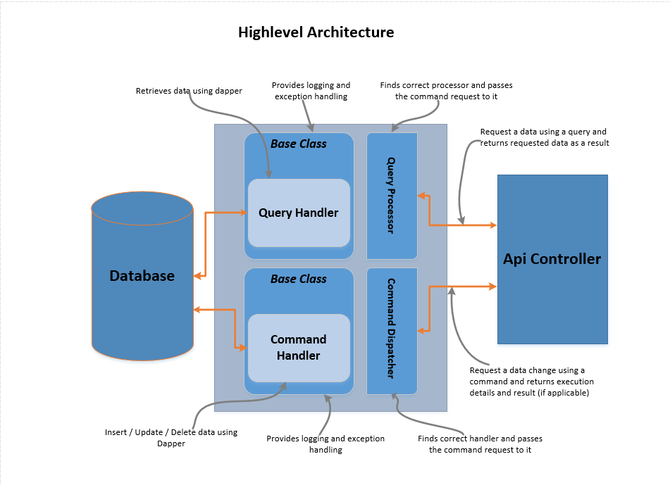
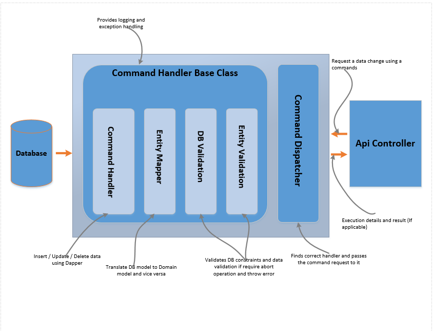
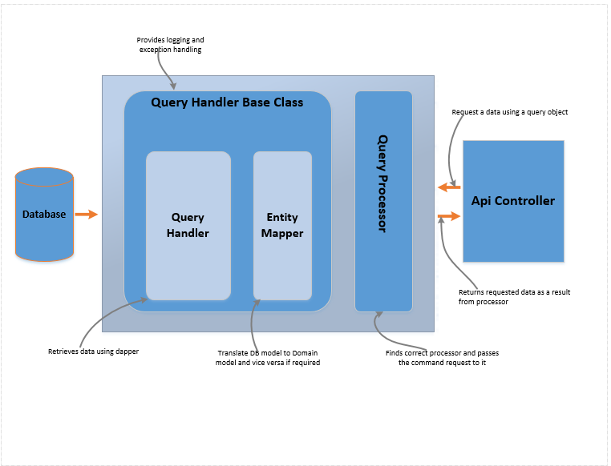

# Prakrishta.Cqs.Data.Infrastructure

The command query separation pattern is very simple, every method should either be a command that performs an action, or a query that returns data to the caller, but never both.

Simply put: a query should never mutate state, while a command can mutate state but should never have a return value.

This design pattern follows SOLID principle (SRP & OCP).

The interfaces defined in "Query" folder has methods to read data from data store. (Can use EF or Dapper or any ORM tool for data retrieval from data store). You should implement "IQueryEntity" generic interface to define filter conditions and "IQueryHandler" generic interface to implement data querying operation.

The interfaces defined in command folder has methods to do operations that will mutate the data. As metioned above you can use any ORM tool (not both as you do in CQRS). You should implement "ICommandEntity" to send modified data to CommandHandler which will do the data modification operation. If you want to do any pre validation, you should implement "ICommandPreCondition" interface for that specific entity.

The query processor and command dispatcher classes play the mediator role to find the correct query handler / command handler.

To add all implementation classes at oneshot using scrutor in dot net core
```
services.Scan(
      x =>
      {
          var entryAssembly = Assembly.GetEntryAssembly();
          var referencedAssemblies = entryAssembly.GetReferencedAssemblies().Select(Assembly.Load);
          var assemblies = new List<Assembly> { entryAssembly }.Concat(referencedAssemblies);

          x.FromAssemblies(assemblies)
              .AddClasses(classes => classes.AssignableTo(typeof(ICommandHandler<>)))
                  .AsImplementedInterfaces()
                  .WithScopedLifetime()
              .AddClasses(classes => classes.AssignableTo(typeof(IAsyncCommandHandler<>)))
                  .AsImplementedInterfaces()
                  .WithScopedLifetime()
              .AddClasses(classes => classes.AssignableTo(typeof(IQueryHandler<,>)))
                  .AsImplementedInterfaces()
                  .WithScopedLifetime()
              .AddClasses(classes => classes.AssignableTo(typeof(IAsyncQueryHandler<,>)))
                  .AsImplementedInterfaces()
                  .WithScopedLifetime();
      });
```






